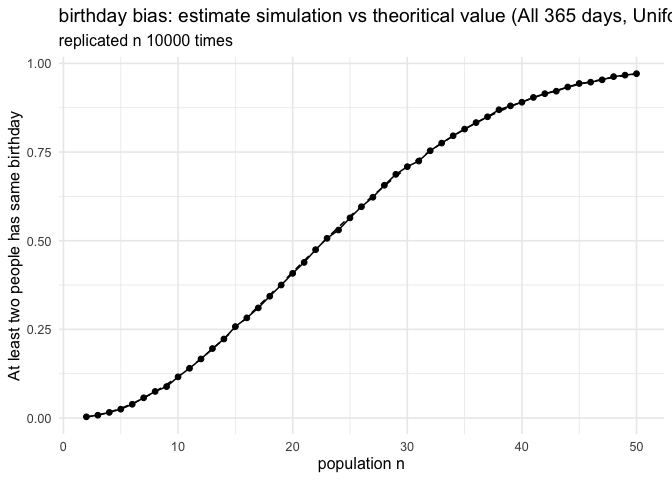
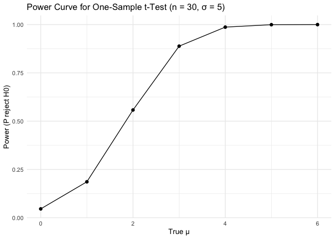
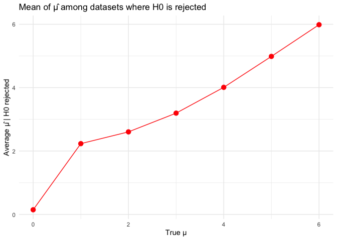
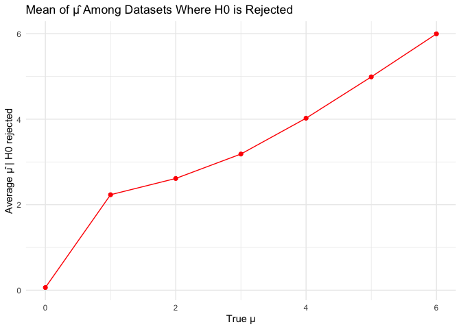
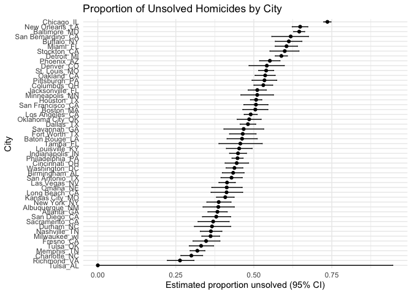

HW5
================

``` r
library(tidyverse)
library(broom)
```

# Problem 1

``` r
set.seed(123)  # to replicate the result
```

### 1) Single simulation (TRUE=there is at least one pair)

``` r
has_match_once <- function(n) {
  
  bdays <- sample.int(365, size = n, replace = TRUE)
  anyDuplicated(bdays) > 0
  
}
```

### 2) For n=2..50，Every n repeat 10000 times and estimate the probability

``` r
ns <- 2:50
n_trials <- 10000
```

### 3) use replicate() + mean() to calculate every n’s probability

``` r
prob_sim <- sapply(ns, function(n) {
  
  mean(replicate(n_trials, has_match_once(n)))
  
})
```

### 4) The probability that “no one has the same birthday”.

``` r
prob_exact <- 1 - sapply(ns, function(n) {
  
  if (n > 365) return(0)              
  prod((365:(365 - n + 1)) / 365)    
  
})
```

### 5) Create a dataframe for plot

``` r
df <- tibble(
  n = ns,
  sim = prob_sim,
  exact = prob_exact
)
df
```

    ## # A tibble: 49 × 3
    ##        n    sim   exact
    ##    <int>  <dbl>   <dbl>
    ##  1     2 0.0033 0.00274
    ##  2     3 0.0079 0.00820
    ##  3     4 0.0158 0.0164 
    ##  4     5 0.0248 0.0271 
    ##  5     6 0.0387 0.0405 
    ##  6     7 0.057  0.0562 
    ##  7     8 0.0749 0.0743 
    ##  8     9 0.0885 0.0946 
    ##  9    10 0.116  0.117  
    ## 10    11 0.140  0.141  
    ## # ℹ 39 more rows

### 6) Use ggplot to visualize the result

``` r
birthday_plot <-
ggplot(df, aes(n, sim)) +
   geom_point() + geom_line() +
   geom_line(aes(y = exact), linetype = 2) +
   labs(x = "population n", y = "At least two people has same birthday",
       title = "Birthday Problem: estimate simulation vs theoritical value (All 365 days, Uniform distribution)",
        subtitle = paste0("replicated n ", n_trials, " times")) +
   theme_minimal(base_size = 12)

birthday_plot
```

<!-- -->

### Answer for question

First, the chance that two people in a small group share the same
birthday is very close to 0. Second, the chance goes up as n goes up and
is greater than 0.5 when n is about 23. Lastly, the chance of sharing a
birthday gets closer to 1 for groups of about 50 people, which means
it’s very likely that at least two people share a birthday.

# Problem 2

### 1) Create 5000 times of simulation

``` r
sim_one_mu <- function(mu, n = 30, sigma = 5, n_sim = 5000) {
  
  replicate(n_sim, {         
    x  <- rnorm(n, mean = mu, sd = sigma)   
    tt <- t.test(x, mu = 0)

    tibble(
      mu_hat  = mean(x),
      p.value = tt$p.value,
      true_mu = mu
    )
  }, simplify = FALSE) |>
    bind_rows()
}

mus <- 0:6
results <- purrr::map_df(mus, sim_one_mu)
```

### 2) Set up the data for the plot

``` r
power_df <- results %>%
  group_by(true_mu) %>%
  summarise(power = mean(p.value < 0.05))

mean_mu_df <- results %>%
  group_by(true_mu) %>%
  summarise(avg_mu_hat = mean(mu_hat))

mean_reject_df <- results %>%
  filter(p.value < 0.05) %>%
  group_by(true_mu) %>%
  summarise(avg_mu_hat_reject = mean(mu_hat))
```

### 3) Plot proportion of times the null was rejected (power)

``` r
power_df <- results %>%
  group_by(true_mu) %>%
  summarise(power = mean(p.value < 0.05))

ggplot(power_df, aes(x = true_mu, y = power)) +
  geom_line() +
  geom_point(size = 1.8) +
  labs(
    x = "True μ",
    y = "Power (P reject H0)",
    title = "Power Curve for One-Sample t-Test (n = 30, σ = 5)"
  ) +
  theme_minimal()
```

<!-- --> It’s easier to
tell the difference when the effect size is bigger, which means it has
more power.The power and impact size are positively correlated in the
graph. The likelihood of rejecting the null hypothesis when it is
incorrect grows in direct proportion to the effect magnitude. The reason
for this is because when the effect size increases, the t-statistic also
increases, further displacing the sample mean distribution from the null
value. More rejections and a higher power are the outcomes of very large
t-values.

### 4) Plot the true value of μ on the x axis.

``` r
mean_mu_df <- results %>%
  group_by(true_mu) %>%
  summarise(avg_mu_hat = mean(mu_hat))

ggplot(mean_mu_df, aes(true_mu, avg_mu_hat)) +
  geom_point(size = 1.8, color = "green") +
  geom_line(color = "green") +
  labs(
    x = "True μ",
    y = "Average μ̂ (all samples)",
    title = "Mean of μ̂ Accross All Simulated Datasets"
  ) +
  theme_minimal()
```

<!-- --> The group mean
μ is a fair way to guess what the real mean is.

### 5) Plot only in samples for which the null was rejected

``` r
mean_reject_df <- results %>%
  filter(p.value < 0.05) %>%
  group_by(true_mu) %>%
  summarise(avg_mu_hat_reject = mean(mu_hat))

ggplot(mean_reject_df, aes(true_mu, avg_mu_hat_reject)) +
  geom_point(size = 1.8, color = "red") +
  geom_line(color = "red") +
  labs(
    x = "True μ",
    y = "Average μ̂ | H0 rejected",
    title = "Mean of μ̂ Among Datasets Where H0 is Rejected"
  ) +
  theme_minimal()
```

<!-- -->

### Answer for the question

The actual underlying value of μ is not consistently matched by the
average of the estimated averages across the simulations that reject H₀.
This is due to selection effects, which are introduced when the
computation is based on a filtered subset instead of all samples.

Only samples with very high 𝜇̂ will provide a significant result when the
real μ is modest, indicating insufficient statistical power.
Consequently, the conditional mean of 𝜇̂ becomes inflated in an unnatural
way.

With an increase in the real ν and a stronger test, almost all samples
result in the rejection of H₀. The distortion is reduced and the
conditional average is brought closer to the actual ν when fewer extreme
samples are required to meet the significance threshold in that case.

# Problem 3

### 1) Load Data

``` r
homicide_data <- read_csv("homicide-data.csv")
```

One row per homicide case from 50 significant U.S. cities is in the raw
dataset. Some major variables are:

Variable Description uid: Unique identification for each homicide case
reported_date: Homicide report date victim_last, victim_first: Name of
victim victim_race, victim_age, victim_sex: Demographic data city,
state: city and state of the homicide lat, lon: Location of incident
disposition: Case status (“Closed by arrest”, “Open/No arrest”, “Closed
without arrest”).

For this project, unsolved killings have:

“Closed without arrest” “Open/No arrest”

### 2) Create city_state variable and define “unsolved” categories

``` r
h <- homicide_data %>%
  mutate(city_state = paste(city, state, sep = "_"))

unsolved_levels <- c("Closed without arrest", "Open/No arrest")
```

### 3) Summarize within each city

``` r
city_summary <- h %>%
  mutate(unsolved = disposition %in% unsolved_levels) %>%
  group_by(city_state) %>%
  summarise(
    total = n(),
    unsolved = sum(unsolved)
  )
knitr::kable(city_summary)
```

| city_state        | total | unsolved |
|:------------------|------:|---------:|
| Albuquerque_NM    |   378 |      146 |
| Atlanta_GA        |   973 |      373 |
| Baltimore_MD      |  2827 |     1825 |
| Baton Rouge_LA    |   424 |      196 |
| Birmingham_AL     |   800 |      347 |
| Boston_MA         |   614 |      310 |
| Buffalo_NY        |   521 |      319 |
| Charlotte_NC      |   687 |      206 |
| Chicago_IL        |  5535 |     4073 |
| Cincinnati_OH     |   694 |      309 |
| Columbus_OH       |  1084 |      575 |
| Dallas_TX         |  1567 |      754 |
| Denver_CO         |   312 |      169 |
| Detroit_MI        |  2519 |     1482 |
| Durham_NC         |   276 |      101 |
| Fort Worth_TX     |   549 |      255 |
| Fresno_CA         |   487 |      169 |
| Houston_TX        |  2942 |     1493 |
| Indianapolis_IN   |  1322 |      594 |
| Jacksonville_FL   |  1168 |      597 |
| Kansas City_MO    |  1190 |      486 |
| Las Vegas_NV      |  1381 |      572 |
| Long Beach_CA     |   378 |      156 |
| Los Angeles_CA    |  2257 |     1106 |
| Louisville_KY     |   576 |      261 |
| Memphis_TN        |  1514 |      483 |
| Miami_FL          |   744 |      450 |
| Milwaukee_wI      |  1115 |      403 |
| Minneapolis_MN    |   366 |      187 |
| Nashville_TN      |   767 |      278 |
| New Orleans_LA    |  1434 |      930 |
| New York_NY       |   627 |      243 |
| Oakland_CA        |   947 |      508 |
| Oklahoma City_OK  |   672 |      326 |
| Omaha_NE          |   409 |      169 |
| Philadelphia_PA   |  3037 |     1360 |
| Phoenix_AZ        |   914 |      504 |
| Pittsburgh_PA     |   631 |      337 |
| Richmond_VA       |   429 |      113 |
| Sacramento_CA     |   376 |      139 |
| San Antonio_TX    |   833 |      357 |
| San Bernardino_CA |   275 |      170 |
| San Diego_CA      |   461 |      175 |
| San Francisco_CA  |   663 |      336 |
| Savannah_GA       |   246 |      115 |
| St. Louis_MO      |  1677 |      905 |
| Stockton_CA       |   444 |      266 |
| Tampa_FL          |   208 |       95 |
| Tulsa_AL          |     1 |        0 |
| Tulsa_OK          |   583 |      193 |
| Washington_DC     |  1345 |      589 |

### 4) Filter for Baltimore

``` r
bal <- city_summary %>% 
  filter(city_state == "Baltimore_MD")

bal_test <- prop.test(bal$unsolved, bal$total)

bal_tidy <- tidy(bal_test)

# Extract key results
bal_estimate <- bal_tidy$estimate
bal_ci_lower <- bal_tidy$conf.low
bal_ci_upper <- bal_tidy$conf.high

bal_table <- tibble(
  estimate = bal_tidy$estimate,
  ci_lower = bal_tidy$conf.low,
  ci_upper = bal_tidy$conf.high
)


knitr::kable(bal)
```

| city_state   | total | unsolved |
|:-------------|------:|---------:|
| Baltimore_MD |  2827 |     1825 |

``` r
knitr::kable(bal_table)
```

|  estimate |  ci_lower |  ci_upper |
|----------:|----------:|----------:|
| 0.6455607 | 0.6275625 | 0.6631599 |

The projected percentage of unsolved killings in Baltimore, MD is
0.6455607. The 95% confidence interval is (0.6275625, 0.6631599)

### 5) Function to run prop.test for one row

``` r
run_test <- function(unsolved, total) {
  
  tidy(prop.test(unsolved, total))
  
}
```

### 6) Apply to ALL cities

``` r
city_results <- city_summary %>%
  mutate(test = map2(unsolved, total, run_test)) %>%
  unnest(test) %>%
  select(city_state, total, unsolved, estimate, conf.low, conf.high)
```

    ## Warning: There was 1 warning in `mutate()`.
    ## ℹ In argument: `test = map2(unsolved, total, run_test)`.
    ## Caused by warning in `prop.test()`:
    ## ! Chi-squared approximation may be incorrect

``` r
knitr::kable(city_results)
```

| city_state        | total | unsolved |  estimate |  conf.low | conf.high |
|:------------------|------:|---------:|----------:|----------:|----------:|
| Albuquerque_NM    |   378 |      146 | 0.3862434 | 0.3372604 | 0.4375766 |
| Atlanta_GA        |   973 |      373 | 0.3833505 | 0.3528119 | 0.4148219 |
| Baltimore_MD      |  2827 |     1825 | 0.6455607 | 0.6275625 | 0.6631599 |
| Baton Rouge_LA    |   424 |      196 | 0.4622642 | 0.4141987 | 0.5110240 |
| Birmingham_AL     |   800 |      347 | 0.4337500 | 0.3991889 | 0.4689557 |
| Boston_MA         |   614 |      310 | 0.5048860 | 0.4646219 | 0.5450881 |
| Buffalo_NY        |   521 |      319 | 0.6122841 | 0.5687990 | 0.6540879 |
| Charlotte_NC      |   687 |      206 | 0.2998544 | 0.2660820 | 0.3358999 |
| Chicago_IL        |  5535 |     4073 | 0.7358627 | 0.7239959 | 0.7473998 |
| Cincinnati_OH     |   694 |      309 | 0.4452450 | 0.4079606 | 0.4831439 |
| Columbus_OH       |  1084 |      575 | 0.5304428 | 0.5002167 | 0.5604506 |
| Dallas_TX         |  1567 |      754 | 0.4811742 | 0.4561942 | 0.5062475 |
| Denver_CO         |   312 |      169 | 0.5416667 | 0.4846098 | 0.5976807 |
| Detroit_MI        |  2519 |     1482 | 0.5883287 | 0.5687903 | 0.6075953 |
| Durham_NC         |   276 |      101 | 0.3659420 | 0.3095874 | 0.4260936 |
| Fort Worth_TX     |   549 |      255 | 0.4644809 | 0.4222542 | 0.5072119 |
| Fresno_CA         |   487 |      169 | 0.3470226 | 0.3051013 | 0.3913963 |
| Houston_TX        |  2942 |     1493 | 0.5074779 | 0.4892447 | 0.5256914 |
| Indianapolis_IN   |  1322 |      594 | 0.4493192 | 0.4223156 | 0.4766207 |
| Jacksonville_FL   |  1168 |      597 | 0.5111301 | 0.4820460 | 0.5401402 |
| Kansas City_MO    |  1190 |      486 | 0.4084034 | 0.3803996 | 0.4370054 |
| Las Vegas_NV      |  1381 |      572 | 0.4141926 | 0.3881284 | 0.4407395 |
| Long Beach_CA     |   378 |      156 | 0.4126984 | 0.3629026 | 0.4642973 |
| Los Angeles_CA    |  2257 |     1106 | 0.4900310 | 0.4692208 | 0.5108754 |
| Louisville_KY     |   576 |      261 | 0.4531250 | 0.4120609 | 0.4948235 |
| Memphis_TN        |  1514 |      483 | 0.3190225 | 0.2957047 | 0.3432691 |
| Miami_FL          |   744 |      450 | 0.6048387 | 0.5685783 | 0.6400015 |
| Milwaukee_wI      |  1115 |      403 | 0.3614350 | 0.3333172 | 0.3905194 |
| Minneapolis_MN    |   366 |      187 | 0.5109290 | 0.4585150 | 0.5631099 |
| Nashville_TN      |   767 |      278 | 0.3624511 | 0.3285592 | 0.3977401 |
| New Orleans_LA    |  1434 |      930 | 0.6485356 | 0.6231048 | 0.6731615 |
| New York_NY       |   627 |      243 | 0.3875598 | 0.3494421 | 0.4270755 |
| Oakland_CA        |   947 |      508 | 0.5364308 | 0.5040588 | 0.5685037 |
| Oklahoma City_OK  |   672 |      326 | 0.4851190 | 0.4467861 | 0.5236245 |
| Omaha_NE          |   409 |      169 | 0.4132029 | 0.3653146 | 0.4627477 |
| Philadelphia_PA   |  3037 |     1360 | 0.4478103 | 0.4300380 | 0.4657157 |
| Phoenix_AZ        |   914 |      504 | 0.5514223 | 0.5184825 | 0.5839244 |
| Pittsburgh_PA     |   631 |      337 | 0.5340729 | 0.4942706 | 0.5734545 |
| Richmond_VA       |   429 |      113 | 0.2634033 | 0.2228571 | 0.3082658 |
| Sacramento_CA     |   376 |      139 | 0.3696809 | 0.3211559 | 0.4209131 |
| San Antonio_TX    |   833 |      357 | 0.4285714 | 0.3947772 | 0.4630331 |
| San Bernardino_CA |   275 |      170 | 0.6181818 | 0.5576628 | 0.6753422 |
| San Diego_CA      |   461 |      175 | 0.3796095 | 0.3354259 | 0.4258315 |
| San Francisco_CA  |   663 |      336 | 0.5067873 | 0.4680516 | 0.5454433 |
| Savannah_GA       |   246 |      115 | 0.4674797 | 0.4041252 | 0.5318665 |
| St. Louis_MO      |  1677 |      905 | 0.5396541 | 0.5154369 | 0.5636879 |
| Stockton_CA       |   444 |      266 | 0.5990991 | 0.5517145 | 0.6447418 |
| Tampa_FL          |   208 |       95 | 0.4567308 | 0.3881009 | 0.5269851 |
| Tulsa_AL          |     1 |        0 | 0.0000000 | 0.0000000 | 0.9453792 |
| Tulsa_OK          |   583 |      193 | 0.3310463 | 0.2932349 | 0.3711192 |
| Washington_DC     |  1345 |      589 | 0.4379182 | 0.4112495 | 0.4649455 |

### 7) Visualize the result

``` r
city_results %>%
  arrange(estimate) %>%
  mutate(city_state = factor(city_state, levels = city_state)) %>%
  ggplot(aes(x = city_state, y = estimate)) +
  geom_point() +
  geom_errorbar(aes(ymin = conf.low, ymax = conf.high), width = 0.2) +
  coord_flip() +
  labs(
    title = "Proportion of Unsolved Homicides by City",
    x = "City",
    y = "Estimated proportion unsolved (95% CI)"
  ) +
  theme_minimal(base_size = 8)
```

<!-- -->
